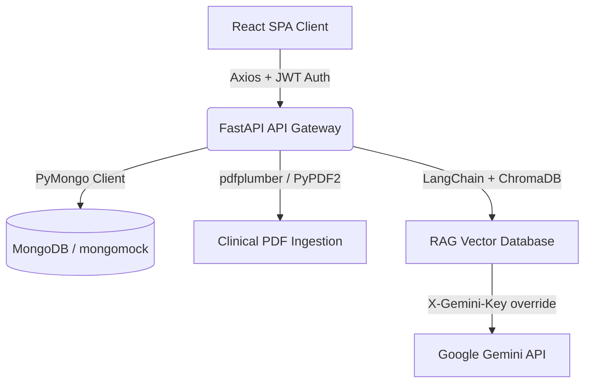
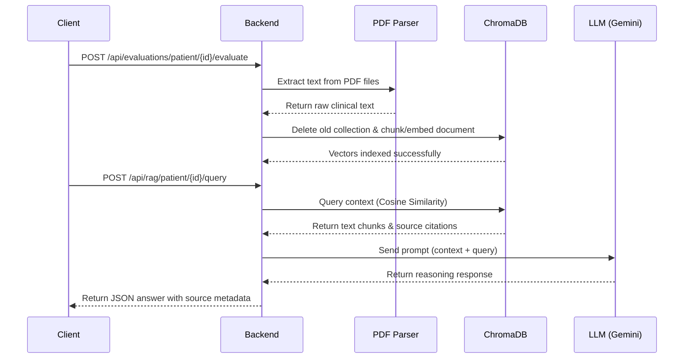

# MedTrial - System Architecture & Engineering Document

This document provides a comprehensive overview of the design patterns, code organization, data flows, and technical integrations powering the **MedTrial** Clinical Assistant.

---

## 🏗️ 1. High-Level System Topology

MedTrial is built as a split-architecture system separating the client presentation space from the data parsing and cognitive orchestration services.



### Core Flow of Operations:
1. **Authentication**: The client logs in, receives a stateless JWT access token, and stores it in `localStorage`.
2. **Patient Intake**: The client sends patient demographics or uploads clinical PDFs. The backend parses PDFs and updates MongoDB.
3. **Scan & Evaluation**: The backend runs eligibility rules against patient data, saves results to the database, and indexes parsed text into patient-specific ChromaDB vector collections.
4. **Interactive Q&A**: The doctor queries patient records via the chat workspace. The RAG service fetches the most relevant context blocks from ChromaDB and invokes Gemini to construct a cited answer.

---

## 🔒 2. Authentication & Security Framework

MedTrial implements stateless JWT authentication following OAuth2 standards:

- **Password Hashing**: Passwords are saved as cryptographically salted hashes using pure `bcrypt`.
- **Token Generation**: Successful logins sign a JWT token containing token type, expiration time (`ACCESS_TOKEN_EXPIRE_MINUTES = 60`), and the user's login ID.
- **Request Interceptor**: The frontend Axios client automatically attaches the authorization header on outgoing calls:
  ```javascript
  config.headers.Authorization = `Bearer ${token}`;
  ```
- **Gemini Key Override**: X-Gemini-Key headers allow investigators to provide user-level LLM access keys. Keys are kept purely in the browser session, guaranteeing server-side data privacy.

---

## 📚 3. RAG Data Ingestion & Retrieval Pipeline

The RAG framework utilizes LangChain abstractions coupled with ChromaDB vector indices:



- **Text Splitting**: Documents are segmented using LangChain's `RecursiveCharacterTextSplitter` with a `chunk_size` of 400 characters and a `chunk_overlap` of 80 characters, preserving clinical context across chunk boundaries.
- **Embeddings**: Uses Google Generative AI embeddings (`models/embedding-001`). If offline or credentials are missing, a deterministic Mock Embeddings fallback ensures the app remains operational.
- **Vector Storage**: Separate ChromaDB collections are created dynamically for each patient using the name template `patient_{patient_id}`, isolating medical histories.

---

## 🏛️ 4. SOLID Design Patterns (Frontend Refactoring)

To ensure the codebase is maintainable, scalable, and easy to test, the monolithic match analyzer layout has been refactored into modular components following **SOLID** design principles.

### Single Responsibility Principle (SRP)
Each component is dedicated to a single piece of UI layout and presentation logic:
- `PatientSelector`: Renders the switcher dropdown and maps selections.
- `PatientHeaderCard`: Renders the demographic details and the SVG match score gauge.
- `NarrativeReport`: Displays the expert Gemini medical reasoning text.
- `ClinicalRecordCard`: Formats raw clinical reports with medical entity tagging.
- `CriteriaTabs`: Houses the state and views for checklist tabs and Chart.js radar components.

### Open/Closed Principle (OCP)
The tab contents are separated into structured components (`CriteriaChecklist` and `SafetyAlerts`). Adding new tabs or criteria categories requires no changes to the main analyzer coordinator page.

### Liskov Substitution Principle (LSP)
Every component receives strictly defined props (`patient`, `evaluation`, `onSelect`), acting as pure visual engines that behave consistently across any route or parent wrapper.

### Interface Segregation Principle (ISP)
Sub-components do not receive broad context containers. For instance, the `NarrativeReport` only receives `{ summary }` instead of the full database evaluation record, limiting scope.

### Dependency Inversion Principle (DIP)
Data retrieval and state variables are managed by the container component (`TrialMatchAnalyzer.jsx`). Visual cards are decoupled from Axios configurations or local storage engines.

---

## 📊 5. Document Database Schema (MongoDB Collections)

MedTrial structures documents in JSON-like formats within MongoDB collections. In-memory fallback via `mongomock` mirrors this document model.

### `users` Collection
- `_id` (ObjectId, Primary Key)
- `name` (String, Required)
- `email` (String, Unique, Index)
- `hashed_password` (String, Required)
- `role` (String, e.g. "Lead Investigator")
- `created_at` (DateTime)

### `patients` Collection
- `_id` (ObjectId, Primary Key)
- `name` (String, Required)
- `age` (Integer, Required)
- `gender` (String, Required)
- `report_text` (Text, Optional)
- `lab_notes` (Text, Optional)
- `current_meds` (Text, Optional)
- `trial_title` (String, Optional)
- `trial_criteria` (String, Optional)
- `user_id` (String, foreign key reference to user `id`)
- `created_at` (DateTime)

### `evaluations` Collection
- `_id` (ObjectId, Primary Key)
- `patient_id` (String, unique match assessment relation key)
- `match_score` (Integer)
- `status` (String, e.g. "Eligible", "Borderline", "Excluded")
- `inclusion_matches` (Array of dicts: met/unmet parameters)
- `exclusion_matches` (Array of dicts: met/unmet parameters)
- `adverse_warnings` (Array of dicts: ADR drug interactions)
- `radar_data` (Array of integers: 5-axis metric scores)
- `summary` (Text, Narrative reasoning summary)
- `created_at` (DateTime)
